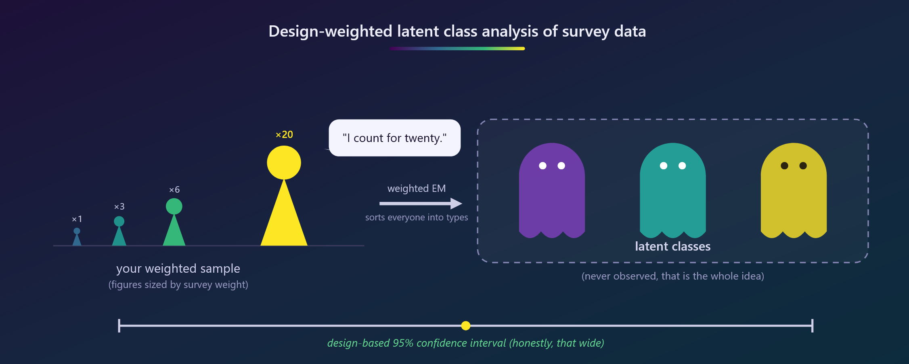
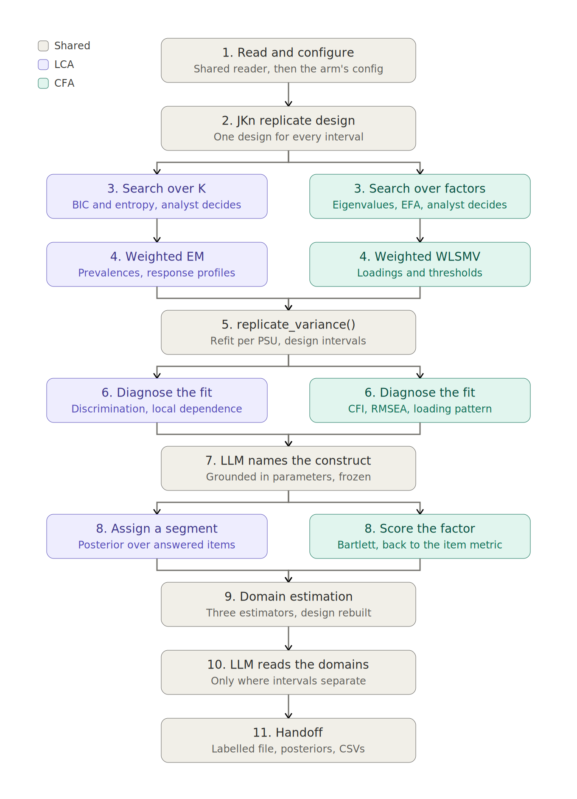

# WISE: Weighted Inference for Survey Estimation



Latent variable measurement for complex survey data, with design-based variance carried through every stage. One stratified jackknife (JKn) replicate design generates every standard error in the analysis: the measurement model parameters, the domain estimates within demographic groups, and the corrections applied to them. Nothing is computed under an independence assumption at any point.

Two arms share a design, an engine, and a replicate variance routine:

- **Latent class analysis**, for a battery where respondents differ in *which* answers they favour. Output is a segment per respondent and a share per group.
- **Confirmatory factor analysis**, for a battery where respondents differ in *how much*. Output is a position on a continuum and a group mean.

Which one a battery calls for is a property of the data, and the workflow reports the evidence rather than choosing for you. A latent class is called a **segment** throughout; the statistical object is unchanged.

## Why this exists

Fitting a latent variable model to survey data is not the hard part. Reporting honest uncertainty is. Design-weighted point estimation is available in several packages. Standard errors that respect stratification and clustering, carried without interruption from the measurement model through to domain estimates and the corrections applied to them, are not available jointly in R.

The gap is not academic. In the demonstration data a loading's design-based standard error is roughly twice what `lavaan` reports by default, and a domain estimate's is roughly twice the naive one. An analyst using the defaults would call differences significant that the data cannot support.

Two design choices follow from that.

**Replication rather than linearization.** A pseudo-likelihood does admit a sandwich variance, so this is a choice and not a necessity. Replication propagates to new statistics without rederivation, which is why adding the factor arm required no new variance code at all; it avoids inverting a several-hundred-dimensional information matrix with parameters at the boundary; and it makes the design specification auditable.

**The analyst decides the dimension.** Neither arm selects the number of segments or factors. Each renders the search evidence, stops, and waits for a number in the config. That decision is recorded in a file rather than buried in a default.

## The workflow at a glance



Four stages are shared and identical code: reading and configuring, the replicate design, the variance routine, and the domain estimation that follows scoring. Four branch: the search over dimensions, the measurement model, the fit diagnostics, and scoring. The branches rejoin twice, which is why adding the factor arm to a pipeline built for the class arm needed no new variance code.

Naming happens after the diagnostics and before scoring, because a model that fails its diagnostics should be refit rather than named, and the domain tables are unreadable without names.

## Repository layout

Six files. Two are edited per dataset, one is never edited.

```         
survey_data_read.R      the file path, design columns, demographic recodes   shared
source_code.R           the engine: EM, WLSMV, replicate variance, prompts   shared
survey_lca_config.R     items and settings for the class arm
survey_lca_report.qmd   the class analysis
survey_cfa_config.R     items and settings for the factor arm
survey_cfa_report.qmd   the factor analysis
```

`survey_data_read.R` is shared deliberately. The demographic recodes are the one place where a mistake is silent, and two copies would give it two places to hide. The item lists live in the method configs and are allowed to differ: a battery suited to one arm is usually not suited to the other, and forcing them to match would cripple one model to flatter the other.

Each arm writes to its own output folder, so the two never overwrite each other.

## The workflow

Render with the dimension unset. Both reports run their search and stop with a note where the chosen model would be. Read the evidence, set `K_force` or `n_factors` in the config, re-render.

|   | Class arm | Factor arm |
|------------------------|------------------------|------------------------|
| Search evidence | BIC, entropy across K | eigenvalues with intervals, EFA fit, structure stability |
| Diagnostics | item discrimination, bivariate residuals | loadings, modification indices |
| Scoring | posterior over answered items | Bartlett factor scores |
| Domain estimate | share of a group in each segment | mean position of each group |

Both arms report the same three estimators for every domain quantity: naive, design-based, and corrected for the attenuation the assignment step introduces. The first gap is what ignoring the design costs. The second is what the assignment costs.

Both score more respondents than they estimated on. Item nonresponse is not random, so restricting domain estimates to complete responders selects on the composition being measured.

## Choosing between the arms

The question is whether people differ in *how much* or in *which*. The workflow answers it with a level-to-pattern ratio: how much the segments differ in overall level, against how much they differ in which items they favour, with every item rescaled so that a binary and a four-category item contribute equally.

On the demonstration survey the same diagnostic separates two batteries cleanly. Thirteen institutional trust items, all one format asking one kind of question about different objects, return 0.55 and a first eigenvalue six times the second: one continuum, which the factor arm describes with a fraction of the parameters. Twelve economic vulnerability items of mixed format across unrelated domains return 3.43: a household can own a computer and still have run short of food, and no single continuum holds that.

## Reproducibility

Starting values are drawn in the main session from a deterministic seed sequence and passed to the workers as data, so no worker touches the random number generator and results are identical under sequential and parallel plans and under any number of workers.

For the names the language model drafts, the mechanism is a freeze file rather than a seed. When the label file exists it is used and validated; otherwise the model drafts once and writes it. Editing that file is how the analyst takes over naming; deleting it triggers a redraft. A seed would be reproducible only for a fixed model, endpoint and package version.

## Language model steps

Two, both bounded, both after every number is settled.

**Naming.** The model receives the response probabilities or loadings and the item wording, one call per segment or factor, and returns a draft name. It never sees a covariance matrix, an estimator, or a fit statistic. It is forbidden to add probabilities across response categories, because that arithmetic is unverifiable and the model treats the categories as unordered anyway.

**Reading the domain tables.** R computes which pairs of levels have intervals that do not overlap, and how far the design moves each estimate; the model receives that list and translates it. It never sees a standard error and never decides whether a difference is real. Its output is capped at four findings, because the point is to say where to look rather than to narrate every cell.

Names and readings never enter a computation. A wrong one is a presentation error, not a statistical one, and every table is verifiable against the estimates above it.

## Statistical decisions

- **Variance is the point.** The same replicates drive every standard error in both arms.
- **Design effects are a specification check.** A covariate constant within a cluster must have a design effect equal to the mean cluster size. If it does, the cluster identifier and the variance formula are jointly correct. A design effect below one indicates composition controlled at the final selection stage, and that precision is a fieldwork artifact.
- **Singleton strata are a hard stop.** `survey.lonely.psu` governs linearization, not replicate construction, so a singleton would silently contribute zero variance. The check runs on the analysis frame, since case exclusions can create singletons the released file does not have.
- Weights enter every estimation step, so estimates describe the population.
- Information criteria rescale the log-likelihood to the sum-to-n scale; without it BIC leans toward too many segments.
- The bootstrap likelihood ratio test is omitted: its resampling presumes independent observations.
- Bivariate residuals are total variation distance between the observed and model-implied two-way table. Bounded in [0, 1], zero under exact local independence, and no division by a possibly empty expected cell. No reference distribution is valid here, so this ranks rather than tests.
- Modification indices and factor-count fit indices are rankings, not tests. Both ignore clustering and are inflated by roughly the design effect.
- Structure stability replaces a holdout split. Refitting on each replicate and counting how often the loading pattern reproduces answers the same question a holdout would, and costs no cases. That matters at the sample sizes this workflow targets.
- Attenuation is corrected and reported, not assumed away. Modal assignment and shrunken factor scores both understate group differences, so a difference that survives is real while a null is not evidence of absence.
- The delivered file carries posteriors and correction weights, not only the assignment. Cross-tabulating the assignment alone reintroduces exactly the attenuation the correction removes, and the variable label says so.

## What is checked automatically

These halt the render rather than produce a wrong number: a response label unmatched by an explicit recode rule; a configured column absent from the data; a stratum containing a single primary sampling unit in the analysis frame; a mismatch between the number of estimated domain quantities and their metadata; a label file whose row count does not match the chosen dimension; and a factor specification naming an item that was dropped.

## What the analyst must check

The recode audit, once per dataset. The weight coefficient of variation and unequal weighting effect, which say whether weighting is doing anything in this file. The search evidence, to choose the dimension. Assignment quality by number of items answered, to set the information floor. The drafted names against the profiles or loadings behind them. And the shift between estimators relative to its standard error, to decide which to report.

## Related work

`baysc` (Wu, Williams, Savitsky and Stephenson 2024, *Biometrics* 80(4) ujae122) fits a weighted objective in a Bayesian pseudo-posterior with a post-hoc variance adjustment. It selects the number of classes through an overfitted mixture, obtains uncertainty from an adjusted posterior rather than replicate weights, and needs no attenuation correction because Bayesian estimation propagates classification uncertainty through the posterior draws. It is distributed through GitHub and requires a compiler toolchain, which places it outside what can be installed in some restricted analytic environments. When it reaches CRAN it becomes the natural Bayesian comparator for this work.

Mplus (`TYPE = MIXTURE COMPLEX`) and Stata (`gsem` under `svy`) maximize the same objective with the same weight convention, so point estimates and information criteria should match up to optimizer tolerance and mode selection. Their standard errors are linearization-based where these are replication-based; both are design-consistent and neither corrects the other. The unweighted special case is validated at runtime against `poLCA`.

## Data acknowledgment

The demonstration uses the 2023 AmericasBarometer for Ecuador by the LAPOP Lab at Vanderbilt University. Obtain the data from LAPOP under their terms; nothing here redistributes it. Note that the released weights for this file are nearly constant, so the demonstration exercises the variance machinery rather than the weighting machinery. Both are exercised on production data with informative weights.
